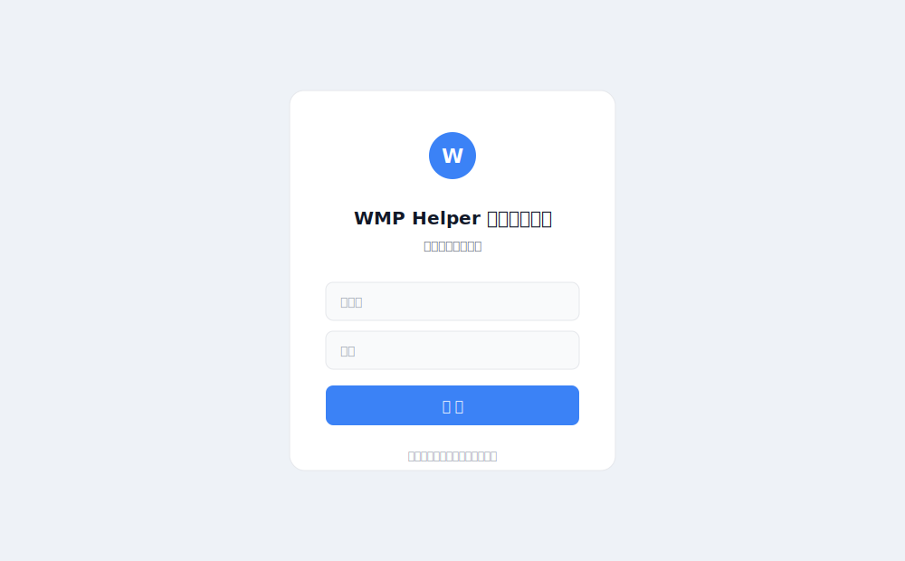
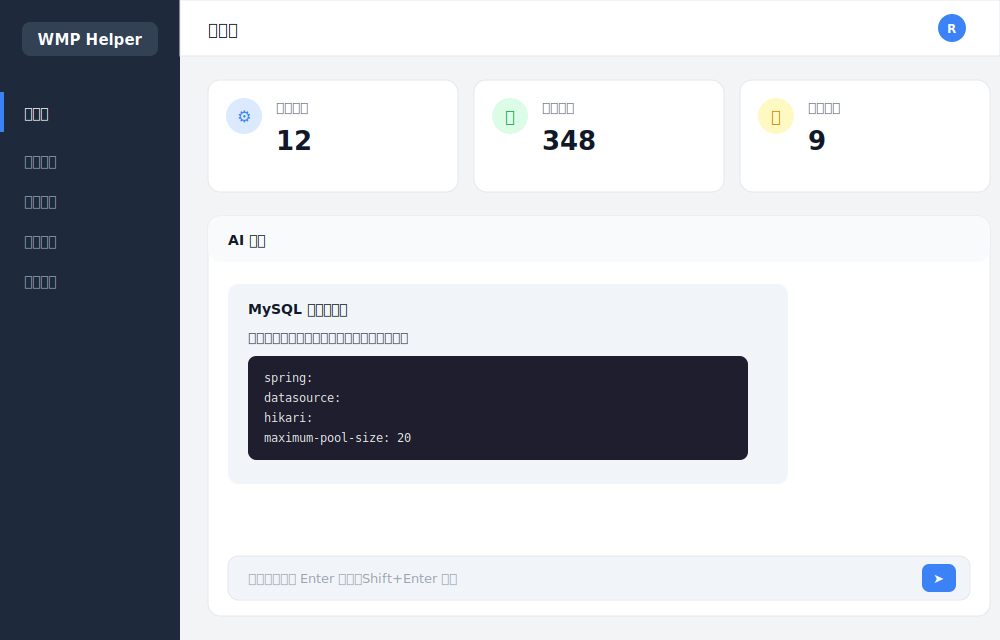
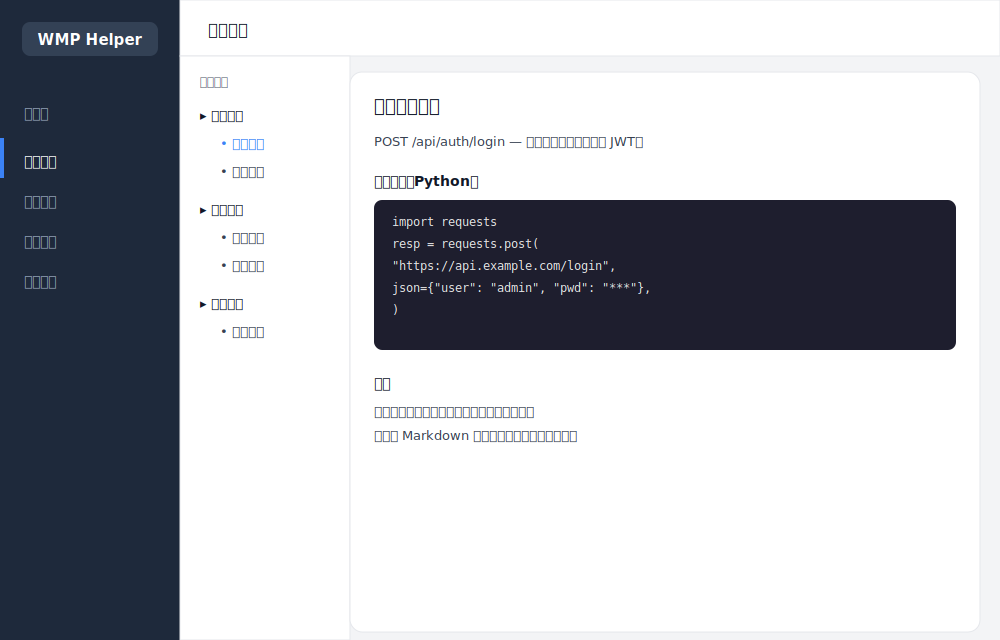
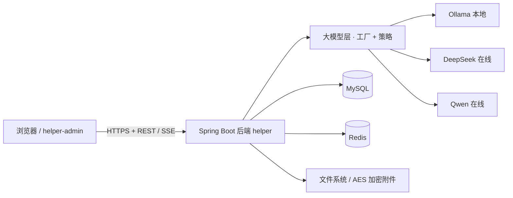

# WMP Helper · 后台管理系统

> 一套面向「接口 / 文档」场景的后台管理系统：支持文档与标签管理、加密附件、全站检索，并内置 **AI 助手**（流式对话 + Markdown 渲染 + 代码高亮），可通过配置在 **Ollama（本地）/ DeepSeek（在线）/ Qwen（在线）** 之间自由切换大模型。

---

## 一、核心功能

| 模块 | 说明 |
| --- | --- |
| **文档管理** | 文档的增删改查、分类菜单管理；标签作为独立实体维护，可灵活绑定到文档。 |
| **附件与下载控制** | 上传的附件在存储层做 **AES 加密**；每份文档可单独开关「允许下载」。 |
| **全站检索** | 跨文档的全局关键词检索（`GlobalSearch`）。 |
| **登录鉴权** | 基于 **JWT** 的登录校验；登录成功后默认进入「仪表盘」。 |
| **AI 助手** | 与文档联动的流式对话；支持 Markdown 渲染、代码块高亮，并**完整保留输出中的空格与缩进**（含代码行首缩进）。 |
| **可插拔大模型** | 采用「工厂 + 策略」模式接入多种大模型，新增模型只需加一个类，主流程零改动。 |

界面示意：

| 登录页 | 仪表盘（含 AI 对话） | 文档浏览（含代码渲染） |
| --- | --- | --- |
|  |  |  |

> 说明：以上为基于真实 UI 结构与配色绘制的**界面示意图**（SVG），用于直观展示布局与功能，非运行截图。

---

## 二、技术栈

**后端（`helper/`，仓库 `wmp-helper`）**

- Spring Boot（Java 8 兼容）
- Maven 构建；MySQL 存储、Redis 缓存
- JWT 鉴权；SSE（Server-Sent Events）流式输出
- 大模型接入：Ollama 本地 API + OpenAI 兼容协议（DeepSeek / Qwen）

**前端（`helper-admin/`，仓库 `wmp-helper-admin`）**

- Vue 3 + Vite
- Vue Router（Hash 模式）、Axios
- markdown-it（AI 回复的 Markdown 渲染）

---

## 三、系统架构



**大模型层设计（工厂 + 策略）**

```
helper/.../llm/
├── LlmProperties.java          # 配置绑定 helper.llm.*（provider / baseUrl / model / apiKey / enabled）
├── LlmStrategy.java            # 策略接口：provider() / isEnabled() / streamChat()
├── LlmStrategyFactory.java     # 工厂：自动收集所有策略，按 provider 名分发
├── AbstractOpenAiStrategy.java # OpenAI 兼容协议基类（DeepSeek / Qwen 共用）
├── OllamaStrategy.java         # provider = ollama（本地 /api/generate）
├── DeepSeekStrategy.java       # provider = deepseek
└── QwenStrategy.java          # provider = qwen
```

每个模型是独立的 `@Service` 实现类，协议细节封闭在各自类内；新增模型只需新增一个类，无需改动工厂与主流程（开闭原则）。`ChatService` 仅负责「开关校验 → 取策略 → 分发」，保持主流程干净。

---

## 四、项目结构（仓库拆分）

本项目拆分为两个独立的 GitHub 仓库：

```
wmp-helper/                # 项目根目录（本说明文档所在）
├── helper/                # 后端仓库 → github.com/Romanlink/wmp-helper
└── helper-admin/          # 前端仓库 → github.com/Romanlink/wmp-helper-admin
```

- 后端仓库：`https://github.com/Romanlink/wmp-helper`
- 前端仓库：`https://github.com/Romanlink/wmp-helper-admin`

---

## 五、快速开始

### 1. 后端（`helper/`）

前置：JDK 8+、MySQL、Redis、Maven。

```bash
cd helper
# 配置数据库连接 / Redis / 大模型（见下节），然后：
mvn package -DskipTests
java -jar target/helper-0.0.1-SNAPSHOT.jar
```

关键配置位于 `src/main/resources/application.properties`，敏感信息（数据库密码、Redis 密码、JWT 签名密钥）**建议通过环境变量注入**，避免写入仓库：

```properties
spring.datasource.password=${DB_PASSWORD:}
spring.redis.password=${REDIS_PASSWORD:}
helper.jwt.secret=${JWT_SECRET:}
```

### 2. 前端（`helper-admin/`）

前置：Node.js 18+。

```bash
cd helper-admin
npm install
npm run dev        # 开发预览
npm run build      # 产物输出到 dist/
```

前端通过 `VITE_API_BASE`（或 `.env.development`）指向后端地址，默认 `http://localhost:8080`。

---

## 六、大模型配置与切换

所有模型参数集中在 `helper.llm.*`，**仅改配置即可切换，无需改代码**。

```properties
# 通用开关
helper.llm.enabled=true
# 当前使用的模型：ollama | deepseek | qwen
helper.llm.provider=ollama
helper.llm.base-url=http://localhost:11434
helper.llm.model=qwen:7b
helper.llm.api-key=
```

**切换到 DeepSeek（在线）**

```properties
helper.llm.provider=deepseek
helper.llm.base-url=https://api.deepseek.com
helper.llm.model=deepseek-chat
helper.llm.api-key=sk-你的key
```

**切换到 Qwen / 通义千问（在线，OpenAI 兼容模式）**

```properties
helper.llm.provider=qwen
helper.llm.base-url=https://dashscope.aliyuncs.com/compatible-mode/v1
helper.llm.model=qwen-plus
helper.llm.api-key=sk-你的key
```

> 在线模型通过 `Bearer` 鉴权调用 OpenAI 兼容的 `/chat/completions` 接口；Ollama 走本地 `/api/generate`。三种模型共用同一套 SSE 输出格式，前端无需区分。

---

## 七、部署提示

- 后端打包为可执行 jar，配合项目根目录的 `deploy-helper.sh` 可一键部署（部署脚本通过环境变量覆盖数据库 / Redis / 大模型等配置）。
- 前端 `npm run build` 后的 `dist/` 为纯静态资源，可用任意静态服务器托管。
- 涉及真实密钥的 `deploy-helper.sh` 与本地 `pdf/`、`logs/` 等运行产物已在 `.gitignore` 中排除，不会进入仓库。

---

## 八、许可证

本项目内部使用，许可证另行约定。
